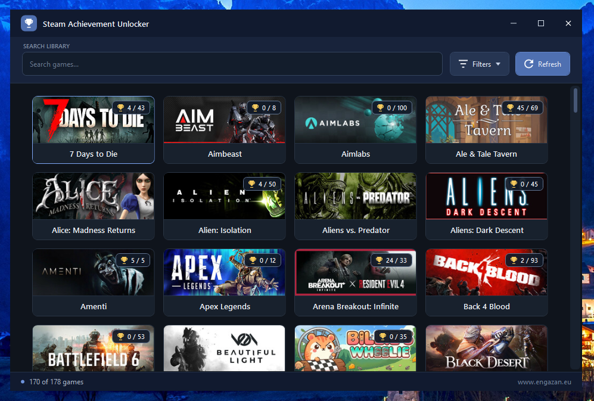

<div align="center">

# Steam Achievement Unlocker

A Windows desktop application for viewing and managing Steam game achievements and statistics through the Steam client.

[](https://github.com/Engazan/steam-achievement-unlocker/releases)
[](#license)


### ⬇️ [**Download the latest release**](https://github.com/Engazan/steam-achievement-unlocker/releases/latest)



</div>

## Why this project exists

The project was created for two legitimate use cases:

- Migrating trophy and achievement progress from PlayStation Network or Xbox to Steam when moving to the Steam version of a game.
- Repairing bugged or permanently unobtainable achievements that game developers no longer maintain or intend to patch.

## Features

- Lists games owned by the current Steam account.
- Discovers owned App IDs through the local Steam client without depending on an external App ID catalog.
- Searches and filters supported game types, including games and demos.
- Displays achievement names, descriptions, icons, unlock state and unlock time.
- Filters achievements by locked/unlocked state and text.
- Sorts achievements by their visible columns.
- Shows global achievement unlock percentages when Steam provides them.
- Unlocks, locks and inverts eligible achievement states.
- Loads and edits supported integer and floating-point Steam statistics.
- Resets supported statistics and stores achievement/statistic changes through Steam.
- Caches the discovered game list for 30 days, along with game artwork and achievement progress, to reduce repeated work and downloads.
- Preserves the picker window placement when opening the game manager.

## Requirements

- Windows with the x86 Steam client installed.
- Steam running and signed in to an account with the selected game available.
- .NET 10 Windows Desktop Runtime (x86).

## Usage

1. Start Steam and sign in.
2. Launch `Steam Achievement Unlocker.exe`.
3. Select a game from the list.
4. Use the game manager to inspect or modify achievements and statistics.
5. Store changes with the Save action or `Ctrl+S`.

To create the single-file Windows distribution, run:

```powershell
dotnet publish SteamAchievementUnlocker/SteamAchievementUnlocker.csproj -p:PublishProfile=WindowsSingleFile
```

The resulting executable is written to `publish/win-x86/`.

## Releases and updates

Releases are generated by GitHub Actions when a tag in the `vMAJOR.MINOR.PATCH` format is pushed, for example:

```powershell
git tag v0.0.1
git push origin v0.0.1
```

The workflow runs the tests, publishes the x86 self-contained single-file executable, creates a GitHub Release and uploads `latest.json` with the download URL and SHA-256 checksum. The application checks this manifest when the game picker starts and offers the update only when a newer version is available. The downloaded executable is checksum-verified before the updater replaces the running installation.

The application communicates with the local Steam client and may also download public game metadata and artwork from Steam-related endpoints. Use it only with games and accounts you control, and keep backups of important data before making changes.

## Project structure

- `SteamIntegration` contains the managed Steam client session and native interop layer.
- `SteamAchievementUnlocker` contains the desktop application.
  - `Application` contains startup, process launching and window placement.
  - `Games` contains game discovery, caching, filtering and the game picker.
  - `Achievements` contains achievement progress, icons and achievement models.
  - `GameManager` contains the achievement editor window and Steam stats logic.
- `tests/SteamAchievementUnlocker.Tests` contains tests for application logic that does not require a running Steam client.

## Implementation notes

The desktop presentation layer is kept separate from the Steam integration and application services. Game discovery, artwork loading, achievement state reading, statistics handling and binary configuration parsing are implemented independently so the UI does not depend directly on native Steam details.

## License

This project is licensed under the [MIT License](LICENSE).
